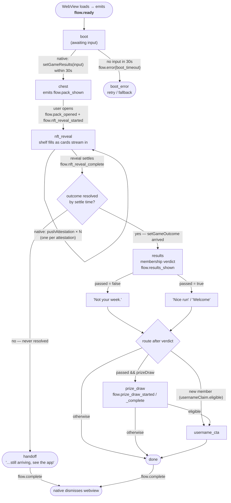

# Flow

How the webview moves through its screens, and **when/how native passes data** over the bridge.
This is the operational companion to [NATIVE_SPEC.md](./NATIVE_SPEC.md) (which has the full payload
schemas). The diagrams below render on GitHub as-is; styled SVG exports (rendered with
[beautiful-mermaid](https://github.com/lukilabs/beautiful-mermaid)) live in [`docs/`](./docs).

## Screen flow (state machine)

The flow is fixed — `chest → reveal → verdict → …` — but *which* later screens appear is decided by
the single `setGameOutcome` native sends. Native calls are shown on the edge that consumes them;
`flow.*` events are what the webview emits back.



> The `passed = false` → "Not your week." edge is the path currently under review: because
> attestations stream in (and may never complete), a non-pass is hard to distinguish from "still
> arriving." The honest alternative is to never send `passed:false` and let the **no-outcome → handoff**
> path cover it.

## Native bridge handshake (when/how data is passed)

`pushAttestation` **streams** (one call per attestation, count grows); everything else is a discrete
call. `passed` is **not** streamed — it's a single one-shot `setGameOutcome`.

```mermaid
sequenceDiagram
    participant N as Native (host app)
    participant W as WebView

    W->>N: flow.ready
    N->>W: setGameResults(input)
    Note right of N: total, member<br/>(gated fields absent)
    Note over W: boot → chest (else 30s → boot_error)
    W->>N: flow.pack_shown
    W->>N: flow.pack_opened
    W->>N: flow.nft_reveal_started

    loop per attestation, real time
        N->>W: pushAttestation(index, hash)
    end

    alt count hits threshold (6) = PASS
        N->>W: setGameOutcome(passed:true)
        Note over W: +gated fields;<br/>pack streams to 10, then settles
    else ~10-min timeout = FAIL (under review)
        N->>W: setGameOutcome(passed:false)
        Note over W: settles now
    else never resolves
        Note over W: settle: 10 cards / 9s quiet / 45s cap
    end

    W->>N: flow.nft_reveal_complete
    Note over W: outcome? results : handoff

    opt new-member username
        W->>N: flow.request_display_name
        N->>W: setDisplayName(name)
        W->>N: flow.username_availability_needed
        N->>W: setUsernameAvailability(...)
    end

    opt prize draw (passed members)
        W->>N: flow.prize_draw_started
        W->>N: flow.prize_draw_complete(won)
    end

    W->>N: flow.complete
    Note over N: dismisses webview
```

## Bridge reference

**Native → webview (`window.*`):**

| Method | Shape | When native calls it |
| :----- | :---- | :------------------- |
| `setGameResults(input)` | `{ attestations:{total}, member, … }` | Once at boot (or preset `window.__GAME_RESULTS__`). Must arrive within **30s**. |
| `pushAttestation({index, hash})` | one passed-attestation | Streamed, one per attestation, in real time. |
| `setGameOutcome({passed, …})` | one-shot verdict + pass-gated fields | Once, when the streamed count hits the threshold (**6**) → `passed:true`; or at the ~10-min timeout → `passed:false` (under review). |
| `setDisplayName(name)` | string | In reply to `flow.request_display_name`. |
| `setUsernameAvailability(…)` | `available` / `taken` / `unknown` (+ alternatives) | In reply to `flow.username_availability_needed`; last-write-wins. |

**Webview → native (`flow.*`):** `ready`, `pack_shown`, `pack_opened`, `nft_reveal_started{count}`,
`nft_reveal_complete`, `results_shown`, `request_display_name`, `username_availability_needed{name}`,
`prize_draw_started`, `prize_draw_complete{won}`, `error{phase, detail}`, `complete`.

Timing constants (`src/App.tsx`): boot timeout 30s, reveal quiet-gap settle 9s, reveal absolute cap
45s, passing threshold 6 of 10.
